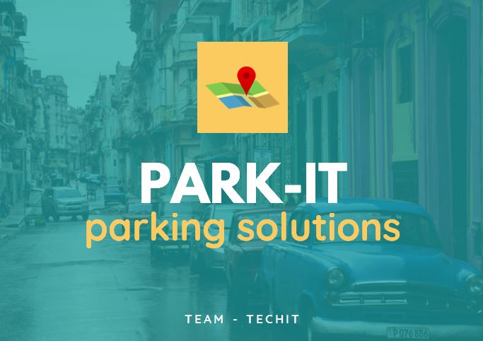
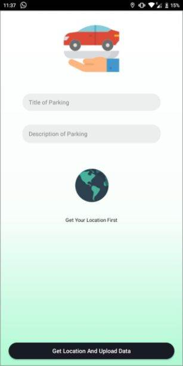

# ParkIT
> ParkIT is a cloud-enabled, IoT + Mobile application based approach to solve the parking problem in current scenario.

[![Python Version][python-image]][pip-url]
[](https://GitHub.com/Naereen/StrapDown.js/graphs/commit-activity)



## Installation

pip:

```sh
pip install google-cloud-firestore
```
# Problem

    -There are many commercial centres located in main places.heavy traffic is caused by shopping activities there. 

    -There is no sufficient parking space in every commercial building. Provide a solution and make a smart parking system for the same issue.

## Usage example

We aim to provide Parking Space to users as well as security of their parkings is also kept in mind.
Apart from that our main USP is the idea of renting Parking space.


### Some Screenshots from Mobile
  


## Release History
* Latest Version
    * Upscaling of Mobile APP as well as Backend for iHack.
* 0.2.0
    * Removed API keys
* 0.1.0
    * The first proper release
* 0.0.1
    * Work in progress
    * Started for TEC Mini Project

## Contributing

1. Fork it (<https://github.com/amartyaa/cloudtraffic/fork>)
2. Create your feature branch (`git checkout -b feature/fooBar`)
3. Commit your changes (`git commit -am 'Add some fooBar'`)
4. Push to the branch (`git push origin feature/fooBar`)
5. Create a new Pull Request

<!-- Markdown link & img dfn's -->
[python-image]: https://img.shields.io/pypi/pyversions/google-cloud-firestore.svg?style=popout
[pip-url]: https://pypi.org/project/google-cloud-firestore/

